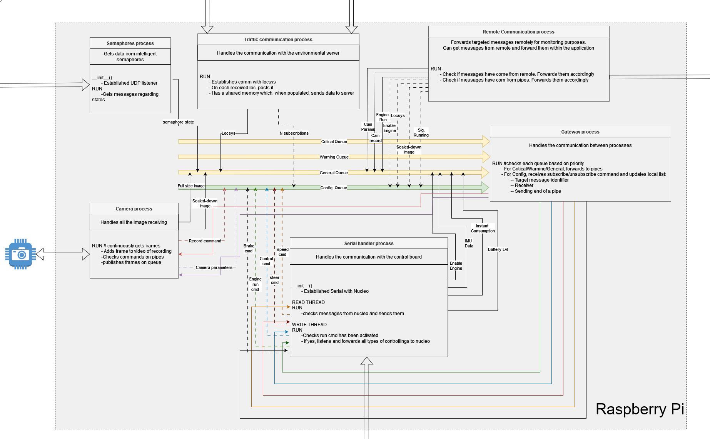

Main Flow
=========

Overview
--------

*The following diagram shows the connections between the different processes and 
the Gateway. All the messages on the arrows can be prioritized as you see fit (General, Warning or Critical).*

Deep dive
---------

++++++++++++++++++++++++
The starting point, Main
++++++++++++++++++++++++

The processes project consist of multiple processes that run concurrently and can be activated or deactivated
using certain **flags** present in the **Main** Script.

This is the script that initiates all the processes, including the most important one - the Gateway. 
The message queues are initialized as well and they are listed based on priority.

  #. Critical
  #. Warning
  #. General   
  #. Config

As mentioned, the queues can be used for prioritization of the messages. Critical, messages that are crucial to the functionality; 
Warning, something that requires attention; general, for all the information; config, for subscribing/unsubscribing to 
certain messages.

The Gateway process is started nonetheless, but all the other processes have **flags** assigned to them. 

*Camera* - enables the Camera process

*PCCommDemo* - it enables the PC Communication with the Demo app

*Sems* - enables Semaphores process

*Traffic* - enables the Traffic Communication process

*SerialHandler* - enables the Serial Handler process

+++++++++++
The Gateway
+++++++++++
The GateWay is responsible with checking continuously the messages on all the different queues.

To subscribe to a certain message type, a specific message must be sent on the config queue, which
subscribes a Pipe to a specific message. From now on, each message of that type arrives, the gateway 
will forward it to the registered pipe. 

The un-subscribing to specific messages can be done the same way as the subscribing.

On the checking of the queues prioritization can be given to the messages, such as discarding general ones if a critical 
messages has arrived.

++++++++++++++++++
The Camera Process
++++++++++++++++++
The Camera Process takes on the crucial role of interacting with the 
car's camera, which is the main sensor of the car.
This process has a thread that captures real-time images of the car's surroundings
on two different channels (big and small resolution) and sends them on the queue. 

The thread is also subscribed to the camera-config message, where other threads/processes can 
send messages to modify some parameters of the camera. 

One other message where the thread is subscribed, is the record message, where start and stop recording commands can be sent. 

++++
Demo
++++
The Demo is actually the display server. It subscribes to all the 
main messages in the car and sends the data to the Demo app, from whom it also receives commands 
such as speed and steering, and sends them on their queue.

This process enables remote controlling and data exchange. 

++++++++++++++++++++++++++
The Serial Handler Process
++++++++++++++++++++++++++
This process establishes and maintains a two-way conversation with the STM32 microcontroller embedded in our vehicle. 
It sends commands to control the car's various functions, such as: speed set, steering angle set, enable battery data reading, enable IMU data
reading and much more... On the other thread instead, it receives information, such as "acknowledge" of the sent command, sensor data (such as "Rotation is...),
readings from the powerboard, and so on.

++++++++++++++++++++++
The Semaphores Process
++++++++++++++++++++++
Explained in the V2X section.

+++++++++++++++++++++++++++++++++
The Traffic Communication Process
+++++++++++++++++++++++++++++++++
Explained in the V2X section.