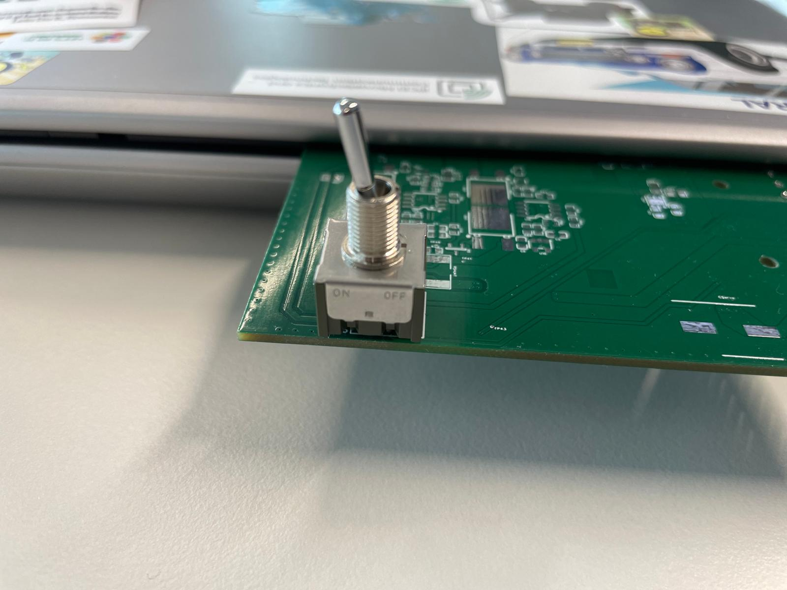
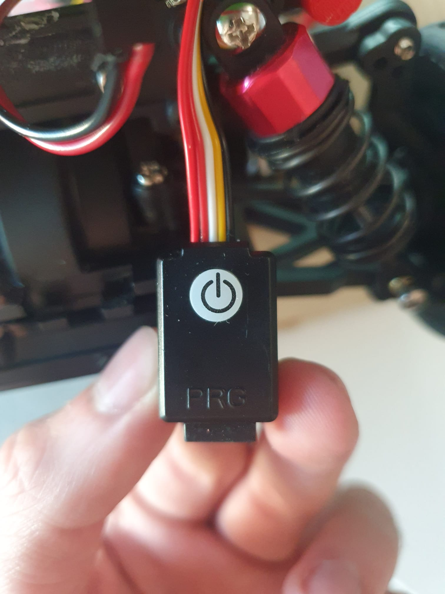
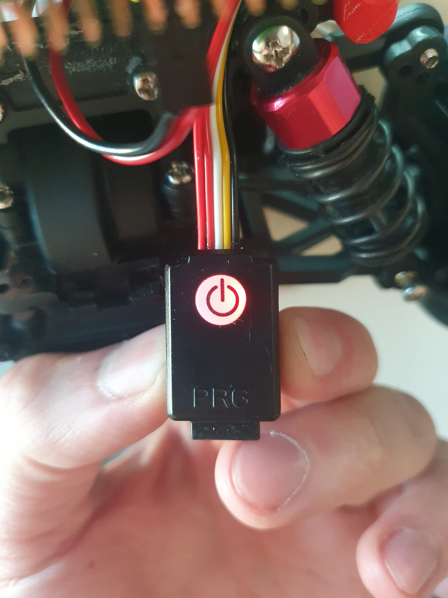

Running
========

1. setup your network.
  
You can either create a a network with the following characteristics:
SSID: BFMCDemo
PKS: bosch23581321

Or connect to the raspbery directly and set up it's network to a different one.

2. Power up the system

- Check the battery connection with the powerboard.
- Turn on the power supply by presing the button.

3. Power up the engine

Simply push the engine button. It will make a long BEEP and after a pause a short BEEP. 
  If the process was carried out successfully, it will have a constant red color. If it failed, you will blink in red. In this case, you will have to restart the ESC by pressing and holding the button until the color disappears, then start it again.
  

4. The provided code will run automatically. 
5. We have a way to check out our demo under the Computer section.