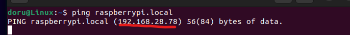
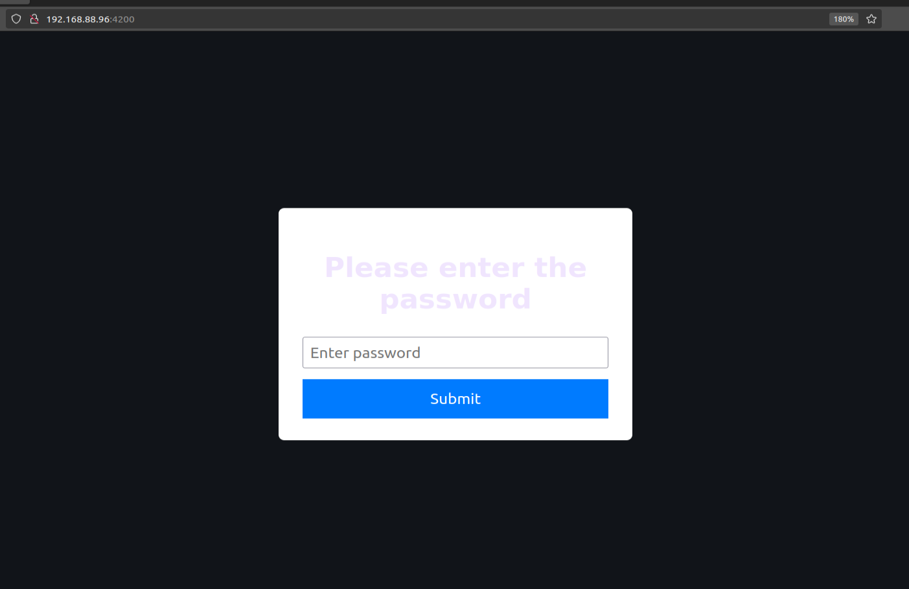
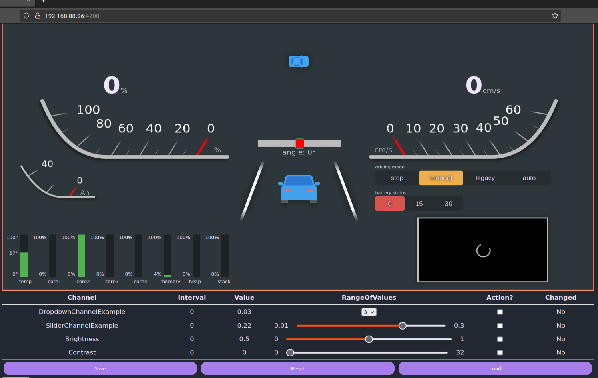
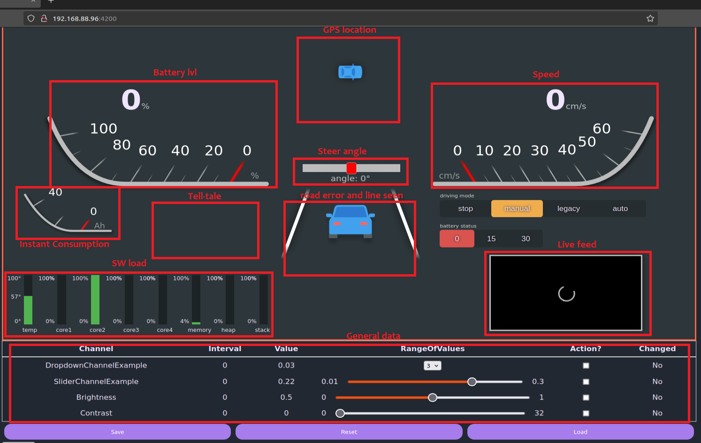

Demo
====

Get Raspberry PI`s IP address.
------------------------------
You will need Raspberry PI`s IP address.

- Open the terminal.
- Enter the following command:

.. code-block:: bash

    ping raspberrypi.local

- The IP address will be displayed just below the command.

Connect to the car server
-------------------------

- Input the same adress in an URL bar, following the port 4200 (as seen below).
- A password field will show up. Leave it empty and press enter.

- Now you should see the following:

- For the challenge, don't forget to change your passward in the Brain/src/dashboard/frontend/src/app/app.component.ts, line 20 and 21

- The dashboard is structured as follows:
  

- Now, to start playing with the car, just activate the Klemme (15 only for reading, 30 for reading and control, so go with 30.
- Activate the manual driving mode.
- Control your vehicle: 
    - W steps up the speed (event based)
    - S steps down the speed (event based)
    - D exponentially turns steering right (hold)
    - A exponentially turns steering left (hold)

- To also include the location and semaphore data, check Simulated servers section.