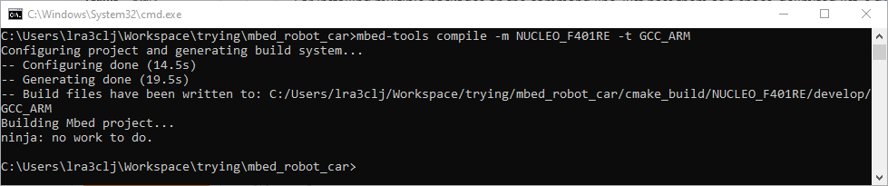
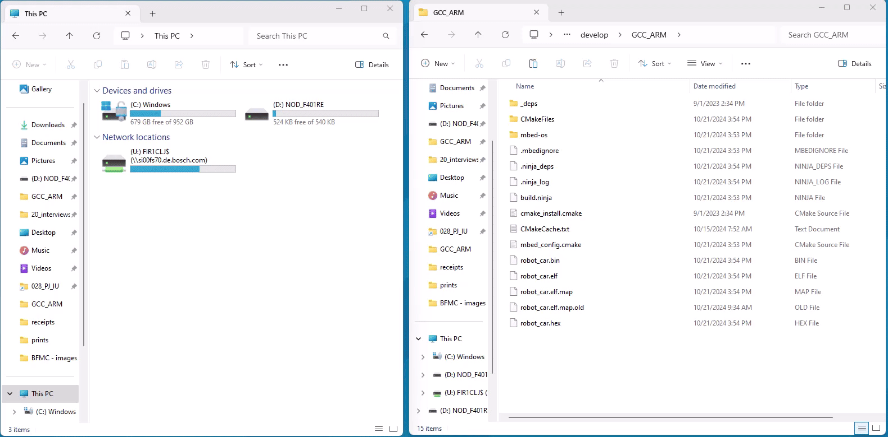

Building and Flashing
=====================

Building 
--------

As for the MBED CLI 2 documentation, mbed-tools command is used for the building, the outcome being as follows (if no modification is done):

This will update the cmake_build directory in your project

Flashing 
--------

The Nucleo board has two main parts: the programmer/debugger and the micro-controller. The programmer has the mini-usb connector while the 
micro-controller part is the one with the connectors. The micro-controller can be powered by external source (USB) or by a power supply (wires), 
while the debugger can be powered on only by the USB. The jumper JP5 near the reset button choses the power source for the micro-controller 
(E5V - via external or U5V - via usb). 

Connect the programmer to your computer (make sure the programmer and make sure the micro-controller are both powered on), and you will see a 
new Path in your file explorer, that being something like: D:Nucleo_F401RE. Simply copy the binary file from cmake_build\\NUCLEO_F401RE\\develop\\GCC_ARM 
directory (mbed_robot_car.bin) on this path.

Another way to flashing your code on the car is to add a "-f" flag to the compile command (check the mbed cli 2 documentation)

During the flashing, the led of the programmer will flash alternatively with Green&Red light, staying still on red once it's finished. At the end, the 
Nucleo will reboot and the code will be running on the board.