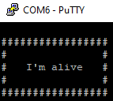

Debugging
=========

You can easily try do debug your Nucleo code by communicating with it via serial. In order to do so, you can install putty and connect the Nucleo 
directly to the PC. Check the COM of the device (in device manager) and then open putty, by setting it as follows:

    - Connection type - Serial
    - Speed - 19200
    - Serial line - COMxx
    - Terminal == local-echo - Force on
    - Terminal == Local line editing - Force on

Go to session and then press Open.

Once you started the putty, a sign that everything works is: == the `I'm alive` message, after that you can try to communicate with it. After each message sent, 
you have to press Ctrl+M, then Ctrl+J. 

The Nucleo has 3 power states: KL0, KL15 and KL30, all designed as a safety feature:
    - ``KL0`` Nothing is working. whatever command you send or ask from the Nucleo, will be discarted.
    - ``KL15`` Only the interaction with the sensors work, actions like: reading data from IMU, reading data regarding instant consumption, total voltage, autonomy...
    - ``KL30`` Enables also the control of the vehicle. Now, messages like: set speed, set seering angle, set movement duration will work.

The Nucleo has a PowerManager, used to protect your work and to increase your safety. Mainly, it does the following:
    - If the battery drops below 7.2 Volts, it sends via serial a warning about it, it does so every x seconds.
    - If the battery drops below 7.1 Volts, it sends via serial an error, and then the nucleo puts itself into sleep mode. 
    - To avoid building each time a battery is changed, it also can receive messages via serial about the capacity of the battery/s connected.

Nucleo expects via serial the following structure:

``#command:val1;val2;valx;;\r\n``

And, for each command that it receives, it sends back the following structure:

``@command:response1;response2;responsex;;\r\n``

Where, ``command`` identifies the message, values are ended by a ``;``, while ``;\r\n`` signals the end of the message.

The commands sent are
----------------------

==================  ==================  ====================  ==============================  ==============================
command             Description         value                 Example request                 Example response      
==================  ==================  ====================  ==============================  ==============================
speeding            Sets the target     signed int Speed      #speed:60;;\\r\\n               @speed:60;;\\r\\n
                    speed of the        [mm/s] (-500,+500)     
  
                    vehicle                   
  
steering            Sets the target     signed int steer      #steer:180;;\\r\\n              @steer:60;;\\r\\n
                    steering of the     [deg*10] (-230,+230)       
  
                    vehicle   
  
braking             Sets the vehicle    signed int steer      #brake:180;;\\r\\n              @brake:60;;\\r\\n
                    in brake state      [deg] (-23,+23)       
  
                    but allows to set         
                    the steering      

battery enable      Enables/Disables    bool                  #battery:1;;\\r\\n              @battery:1;;\\r\\n 
                    publishing total

                    battery value

instant enable      Enables/Disables    bool                  #instant:1;;\\r\\n              @instant:1;;\\r\\n 
                    instant 

                    consumption value

imu enable          Enables/Disables    bool                  #imu:1;;\\r\\n                  @imu:1;;\\r\\n 
                    imu publishing 

                    values

Controlled move     Sets the velocity   signed int Speed      #vcd:80;-130;121;\\r\\n         @vcd:80;-130;121;;\\r\\n
                    control duration    signed int Steer                                    
  
                    i.e. a specific     signed int time     
                    movement for a      [deciseconds] (0,n)   
  
                    period of time    
  
kl                  Sets the power      unsigned int state    #kl:15;;\\r\\n                  @kl:60,;\\r\\n
                    state of the        [0,15,30]   
                      
                    nucleo  
  
batteryCapacity     Sets the capacity   unsigned int          #batteryCapacity:12000;;\\r\\n  @batteryCapacity:60;;\\r\\n
                    of the battery/s    mAh (0,n)

resource enable     Enables/Disables    bool                  #resourceMonitor:1;;\\r\\n      @resourceMonitor:1;;\\r\\n 
                    resource monitor 

                    publishing
==================  ==================  ====================  ==============================  ==============================

Information received 
--------------------

======================  ==================================  =======================================
type                    Example response                    Description
======================  ==================================  =======================================
Battery level           @battery:7800;;\\r\\n               Signals the battery level is 7.8V.

Instant consumption     @instant:1;;\\r\\n                  1 mA consumed in the last second(frequency can be modified).

Warning battery level   @warning:0;1;13;;\\r\\n             possibly 0 hours, 1 minute and 13 seconds until sleep.

Error battery level     @shutdown:ack;;\\r\\n               Nucleo going into shut down mode.

imu data                @imu:1,2,3,4,5,6\\r\\n              roll,pitch,yaw (deg) and accelx,accely,accelz (m/s).

Velocity-control-dur    @vcd:0;0;0;;\\r\\n                  The movement has finished.
======================  ==================================  =======================================

Limits 
------

The Nucleo has a few limits, as follows:
    - The maximum speed is 500 mm/s.
    - The maximum steering angle is 25 degrees.
    - The maximum time for a controlled movement is 255 deciseconds (25,5 seconds).
    - The maximum frequency for the imu is 6.67 Hz (150ms).