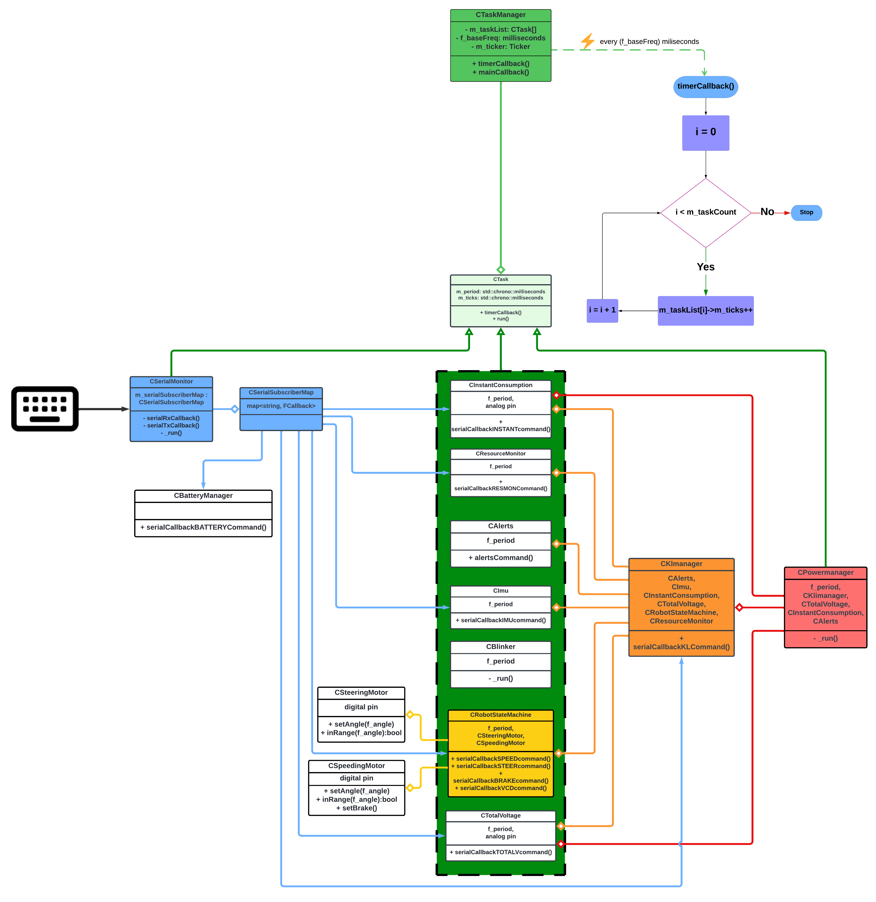

Main Flow
=========

Overview
--------

The flow diagram depicted below outlines the functional operation and the structure of the embedded platform's software. This graphical representation 
facilitates a deeper understanding of how various components interact within the system.

Through the diagram, we aim to showcase the hierarchical nature of different software layers and how they contribute to the overarching functionality 
of the platform. It also illustrates the interaction between the main loop and the various subsystems.

Deep dive
---------