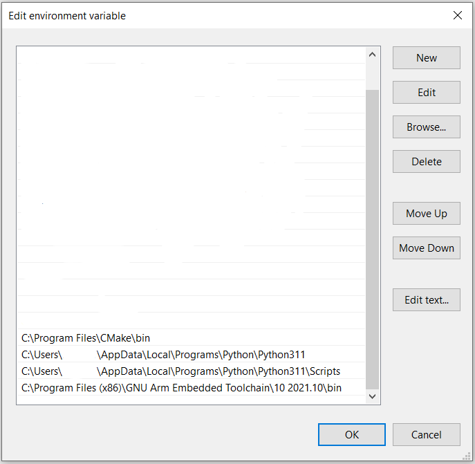

Preliminary setup
==============================

Before you initiate the building process, ensure to correctly set up your environment. Below, you will find a step-by-step guide to setting up the necessary tools and environments:

1. **Python Installation**:
   
   Install a Python version that is 3.6 or newer. You can download it from the `official Python website <https://www.python.org/downloads/>`_.

2. **CMake Installation**:

   Install CMake to manage the build process of your software. `Download it here <https://cmake.org/download/>`_.

3. **Ninja Installation**:

   Install Ninja using the following pip command:

   .. code-block:: bash

      pip install ninja
      python -m pip install ninja

   If you prefer to install it through a different method, you can find the installation commands `on this GitHub page <https://github.com/ninja-build/ninja/wiki/Pre-built-Ninja-packages>`_.

4. **Mbed-tools Installation**:

   Install mbed-tools using the pip command as follows:

   .. code-block:: bash

      pip install mbed-tools
      python -m pip install mbed-tools

5. **Cross-Compiler Installation**:

   Install a cross-compiler to build your project for the Nucleo-F401RE. `Find the suitable one here <https://developer.arm.com/downloads/-/gnu-rm>`_.

6. **Packages for building output**:

   Install some packages for output readability

   .. code-block:: bash

      pip install prettytable intelhex

Windows Setup
~~~~~~~~~~~~~

After installing all the preliminary components, you need to check the environment variables to ensure they are set up correctly. Check if you can find them 
as shown in the image below:

If they are not present, you can copy the following paths to set up your environment variables correctly:

.. code-block:: bash

    C:\Program Files\CMake\bin

.. code-block:: bash

    C:\Users\fill_with_your_user\AppData\Local\Programs\Python\Python3XX

.. code-block:: bash

    C:\Users\fill_with_your_user\AppData\Local\Programs\Python\Python3XX\Scripts

.. code-block:: bash

    C:\Program Files (x86)\GNU Arm Embedded Toolchain\10 2021.10\bin

Make sure to replace ``fill_with_your_user`` with your actual username.

**Setting Up the MBED OS Version**

To set up the necessary MBED OS version, first navigate to the project path in your command prompt or terminal. Once there, fetch the mbed-os from the actual commit specified in the 'mbed-os.lib' file using the "deploy" command. If at any point you wish to use a different MBED OS version, simply modify the line with the desired commit.

.. code-block:: bash

    ``cd path/to/your/project``  
    mbed-tools deploy