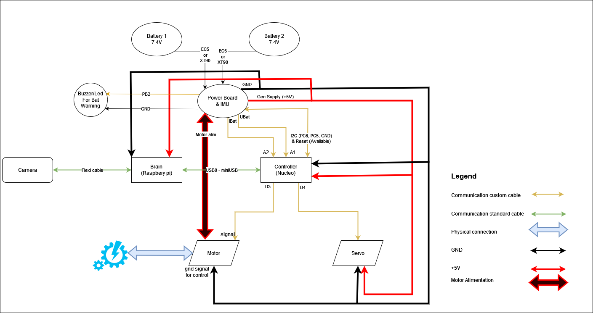

Connection diagram and components
==================================

.. toctree::
   :maxdepth: 1
   :hidden:

   hardwaresetupofcar/hardwareimprovements
   hardwaresetupofcar/steeringcalibration
   hardwaresetupofcar/speedingcalibration
   hardwaresetupofcar/powerboard

* :doc:`Hardware improvements guide <hardwaresetupofcar/hardwareimprovements>`

  - The kit could use some mechanical adjustments, like height elevation, reducing steering limitations, reducing mechanical friction. All by following this guide

* :doc:`Steering calibration guide <hardwaresetupofcar/steeringcalibration>`

  - The kit steering may not be configured properly, so steering value could have an error when doing a movement. By following this guide you can ensure the value set is the real one.

* :doc:`Speeding calibration guide <hardwaresetupofcar/speedingcalibration>`

  - There's not a movement function corelating PWM signal to speed value, so a series of measurements have been done manually. If a more precise resolution is desired (ex: 211.2 mm/s), measurements can be done again by following this guide.

* :doc:`Powerboard & IMU details <hardwaresetupofcar/powerboard>`

  - There's not a movement function corelating PWM signal to speed value, so a series of measurements have been done manually. If a more precise resolution is desired (ex: 211.2 mm/s), measurements can be done again by following this guide.

In this section, you can find all the topics related to the hardware of the vehicle, which is a 1/10 scale on-road chassis variant.

Each vehicle can come with various hardware small modifications, as it is designed for hobby usage. 

Here's the description of the car, with all it's components:

.. image:: ../images/hardwaresetupforcar/Car.png
   :align: center
   :width: 50%

In the following schematics you can see the connections diagram of all the HW components of the car. The GPIO lines are marked on each component.

And here's the table with all the components and all the needed details.
------------------------------------------------------------------------

Table1:

.. table::
   :width: 80%

   ===================  ========================  =========  ================  ======  ============   ====================
   Product              Description               Quantity   Mount Materials   Price   Others         Picture
   ===================  ========================  =========  ================  ======  ============   ====================
   `Chassis`_           The base structure of     1          N/A               ~€74                   .. image:: ../images/hardwaresetupforcar/products/Chassis.jpg
                        the car. Comes   

                        completely assembled. 
                        model: Reely TC-04 

   `Servo`_             Actuator used for the     1          N/A               ~20                    .. image:: ../images/hardwaresetupforcar/products/Servo.jpg
                        steering mechanism. 

                        model: RS-610WP 
                        (or similar) 

   `Motor`_             Brushless motor with      1          N/A               ~€66                   .. image:: ../images/hardwaresetupforcar/products/Motor.jpg
                        integrated ESC.   

                        Controls the speed of 
                        the vehicle. 

                        model: Quickrun Fusion  
                        SE, 1200KV 

   `Brain`_             Single-board computer     1          2x m2x6           ~€80                   .. image:: ../images/hardwaresetupforcar/products/Brain.jpg
                        thought to control the  

                        automated part of the  
                        vehicle (thinking  

                        part). model:                      
                        raspberry pi 5  

   `Cooler`_            Air-Conditioner for       1          2x m2x6           ~€80                   .. image:: ../images/hardwaresetupforcar/products/Brain.jpg
                        your rpi  

   `Controller`_        Micro Controller used     1          2x m3x6            ~€32                  .. image:: ../images/hardwaresetupforcar/products/Controller.jpg
                        to control the motors  

                        and read data from the 
                        sensors and power  

                        board. model: Nucleo  
                        F401RE         
                        
   `Camera`_            Monocular, wide-angle     1          2x m2x6            ~€30                  .. image:: ../images/hardwaresetupforcar/products/Camera.jpg
                        camera, the main sensor              +2x nuts

                        in the vehicle. model:               poly material
                        Raspbery pi  

                        camera-module-3,  
                        wide-angle version 

   `Battery`_           Used to power up the      1          N/A                ~€41   `Battery2`_    .. image:: ../images/hardwaresetupforcar/products/Battery.jpg
                        entire vehicle. It's a       

                        2 cells LiPo battery,                                          `Battery3`_
                        ranging from 4500 mAh  

                        to 6200 mAh (randomly                
                        assigned)  

   `Power board`_       Custom made power         1          3x 25 spacer-nut   N/A                   .. image:: ../PCB/PWR_Board/3D/Top View.png
                        distribution board.  

                        Enables connection of 2 
                        batteries (increased  
                        
                        autonomy), delivers  
                        the power in the entire  

                        vehicle, returns  
                        feedback regarding  

                        battery voltage and the  
                        instant consumption of  

                        the entire vehicle. 
                        It has also the IMU 
                        
                        embedded in it 

   `Imu`_               Custom made IMU board     1          duck tape         N/A                    .. image:: ../PCB/IMU_BOARD/3D/Top View.png

   `uSD Card`_          Micro SD card of 16GB.    1          N/A               ~€5                    .. image:: ../images/hardwaresetupforcar/products/uSD.jpg
                        Serves as the  

                        raspberry  
                        pi memory.Various  

                        brands may be  
                        distributed. 

   `USB0-miniUSB`_      Cable for communication   1          N/A               ~€3                    .. image:: ../images/hardwaresetupforcar/products/USB0-miniUSB.jpg
                        between Raspberry and  

                        Nucleo. USB(RPi) and  
                        mini-USB(Nucleo). It's  

                        a 15cm cable. 

   `Camera cable`_      Cable flexi cable for     1          N/A               ~€1                    .. image:: ../images/hardwaresetupforcar/products/Cameracable.jpg
                        communication between  

                        Raspberry and it's  
                        camera. It's a 30 cm  

                        cable. 

   `RPi alimentation`_  Cable for alimentation    1          N/A                ~€3                   .. image:: ../images/hardwaresetupforcar/products/RPialimentation.jpg
                        of the raspbery pi.  

                        It's a simple type-c  
                        cable 

   `Charger`_           Charger for the LiPo      1          N/A                ~€32   `Charger2`_    .. image:: ../images/hardwaresetupforcar/products/Charger.jpg
                        battery.

   `Car Body`_          The cover body that       1          N/A                ~€40   `Car Body2`_   .. image:: ../images/hardwaresetupforcar/products/CarBody.jpg
                        goes on top of the car,            

                        covering the entire                                            `Car Body3`_
                        vehicle interior.                   

                        model: Lexus, BMW, ford                                        `Car Body4`_
                        assigned randomly. 

                        The vehicle can be  
                        of various colors 
   ===================  ========================  =========  ================  ======  ============   ====================

.. _Chassis: https://www.conrad.com/p/reely-tc-04-onroad-chassis-110-rc-model-car-electric-road-version-4wd-arr-1406735
.. _Servo: https://shop.robitronic.com/en/srt-metallgetriebe-dl3017
.. _Motor: https://www.hobbywingdirect.com/collections/quicrun-fusion-se
.. _Brain: https://www.raspberrypi.com/products/raspberry-pi-5
.. _Cooler: https://www.raspberrypi.com/products/active-cooler
.. _Controller: https://www.conrad.com/p/stmicroelectronics-pcb-design-board-nucleo-f401re-stm32-f4-series-1416924
.. _Camera: https://www.raspberrypi.com/products/camera-module-3/?variant=camera-module-3-wide
.. _Battery: https://www.conrad.com/p/conrad-energy-scale-model-battery-pack-lipo-74-v-5500-mah-no-of-cells-2-20-c-softcase-xt90-1344152
.. _Battery2: https://www.conrad.com/p/hacker-scale-model-battery-pack-lipo-74-v-5000-mah-no-of-cells-2-20-c-softcase-xt90-2178297
.. _Battery3: https://www.conrad.com/p/absima-scale-model-battery-pack-lipo-74-v-6200-mah-60-c-hard-case-xt90-2357348
.. _Power board: https://github.com/ECC-BFMC/Documentation/tree/master/source/PCB/PWR_Board/schematic/Schematic_V3_Final.pdf
.. _Imu: https://github.com/ECC-BFMC/Documentation/tree/master/source/PCB/IMU_BOARD/schematic/Schematic_IMU.pdf
.. _uSD Card: https://www.conrad.com/p/intenso-16-gb-micro-sdhc-card-microsdhc-card-16-gb-class-4-incl-sd-adapter-416887
.. _USB0-miniUSB: https://www.conrad.com/p/renkforce-usb-cable-usb-20-usb-a-plug-usb-mini-b-plug-015-m-black-gold-plated-connectors-rf-4455804-1485268
.. _Camera cable: https://www.raspberrypi.com/products/camera-cable/
.. _RPi alimentation: https://www.conrad.com/p/joy-it-k-1473-power-cable-raspberry-pi-arduino-banana-pi-cubieboard-1x-usb-c-plug-1x-open-cable-ends-100-m-blac-2159636
.. _Charger: https://www.conrad.com/p/voltcraft-v-charge-eco-lipo-3000-scale-model-battery-charger-230-v-3-a-lipolymer-1409525
.. _Charger2: https://www.absima.shop/pp/absima-charger-cube-2-0.htm?shop=absima_en&SessionId=&a=article&ProdNr=4000033&t=19114&c=19196&p=19196
.. _Car Body: https://www.eurorc.com/product/21265/killerbody-lexus-rc-finished-body-orange-190mm
.. _Car Body2: https://hpi-racing.ro/acasa/caroserie-vopsita-ford-mustang-mach-e-1400-200mm.html
.. _Car Body3: https://hpi-racing.ro/onroadtouringdrift/caroserie-hpi-3d-bmw-m3-gt2-e92200mm.html
.. _Car Body4: https://www.hpiracing.com/en/part/160561

And here are the 3d printed components for the car itself. Available also in editable format, as sldprt extension at this link: `solid parts`_.
----------------------------------------------------------------------------------------------------------------------------------------------------

.. _solid parts: https://github.com/ECC-BFMC/Documentation/tree/master/source/3DModels/CustomParts/sldprt..

Table 2

==================  ==========================  ===================  =====================
Product             Description                 Mount Materials      Picture
==================  ==========================  ===================  =====================
`Boards support`_    The support for Raspbery   spacer nut           .. image:: ../images/hardwaresetupforcar/products/Boardsupport.jpg
                     and Nucleo.                threaded rod 
                                                + 2x m3 nuts 
                                                + 2x m3 washers
`Camera support`_    The camera support         m2x20 screw          .. image:: ../images/hardwaresetupforcar/products/Camerasupport.jpg
                     sitself.                   + m2 nut
`Camera rotation`_   The part that enables      2xM3 spacer nut      .. image:: ../images/hardwaresetupforcar/products/Camerarotation.jpg
                     the rotation of the        2xM3 nut + 
                     camera.                    M3 threaded rod
`Chassis mount`_     The part that fixes the    2x M6x12 poly        .. image:: ../images/hardwaresetupforcar/products/Chassismount.jpg
                     entire assemble to the     screw+ 2x nuts

                     chassis.  
==================  ==========================  ===================  =====================

.. _Boards support: https://github.com/ECC-BFMC/Documentation/blob/master/source/3DModels/CustomParts/Nucleo%2BRpi_Suport.STL..
.. _Camera support: https://github.com/ECC-BFMC/Documentation/blob/master/source/3DModels/CustomParts/PIcameraHolderPart2.STL..
.. _Camera rotation: https://github.com/ECC-BFMC/Documentation/blob/master/source/3DModels/CustomParts/PIcameraHolderPart3.STL..
.. _Chassis mount: https://github.com/ECC-BFMC/Documentation/blob/master/source/3DModels/CustomParts/PicameraHolderBase.STL..

There are some parts of the chassis available in STL in editable formats, created due to worn or lost here: `spare parts`_.
---------------------------------------------------------------------------------------------------------------------------------

.. _spare parts: https://github.com/ECC-BFMC/Documentation/tree/master/source/3DModels/CarSpareParts