Hardware improvements
=====================

Let’s say you have just written a script that turns on a light bulb. At the first glance, there is no light coming out from the bulb. What are you going to do? 
Well, sometimes it’s better to check if the bulb is properly plugged in, rather than rewriting your code. 
Basically, this guide explains what modifications can be done to the chassis itself.

FAQ
---

**What are the advantages?**

The advantages are:
    * Developing / improving mechanical skills;
    * Lowering frictions in the system - involving lower current consumption;
    * Smoother driving;
    * Lowering the possibility of getting the car stuck when cornering.

**Can this part be skipped?**

The given car kit has a brushless motor with an integrated esc, which is rotating in a “constant speed” mode, meaning that even if the car tends to get stuck (based 
on the signals received from the Nucleo) the car’s speed will be automatically adjusted and therefore the problem of the smoothness is eliminated (at least 
partially). Nevertheless, as when buying a used car, it is always recommended to give it a mechanical check.

**What tools do I need?**

    * Hex key screwdriver;
    * Grease ;
    * Degrease;
    * Isopropyl alcohol;
    * Sponge & brush;
    * Pliers;
    * Phillips screwdriver;
    * Flat file /  sandpaper.

.. image::  ../../images/hardwaresetupforcar/hardware_improvements/tools.png
   :align: center
   :width: 40%

**How much time do I need?**
    
    * Working time approximately 4 hours.

The transmission from the motor
-------------------------------

The transmission from the motor includes cleaning and greasing the differentials (front and back), adjusting all the distances when 
remounting all the components and checking for whatever frictions may be present. 

**Removing the computer boards’ support**

Disconnect all wires, remove the mounting support’s nut and then remove the safety clamps and case holders.

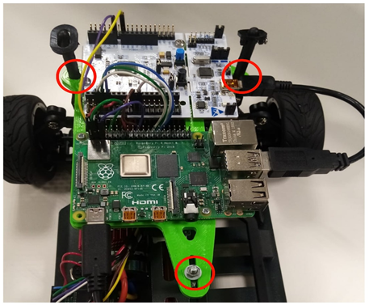

**Removing the back driving shafts**

Unscrew the highlighted screws.

.. image::  ../../images/hardwaresetupforcar/hardware_improvements/back_driving_shaft.png
   :align: center
   :width: 50%

**Removing the differential**

Unscrew the highlighted screws and after step no. 3 you will be able to see the cogwheels.

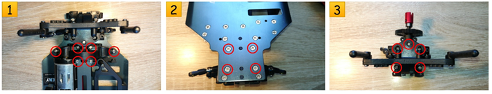

**Cleaning the cogwheels**

    1. Remove both pieces. From Piece A remove the bearing and afterwards remove the washer permanently.
    2. Clean the grease from the differential’s case, cogwheels and bearings. Make sure you also use alcohol for degreasing the bearings until they freely spin.

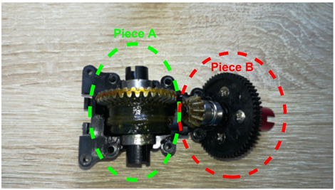

**Tighten the screws equally**

    * Remove the safety washer (A) and then also remove the (B) washer permanently. 
    * Remove the screws from the plastic cogwheel and then try sandpapering the surface where the flange will be attached (until it is perfectly flat).

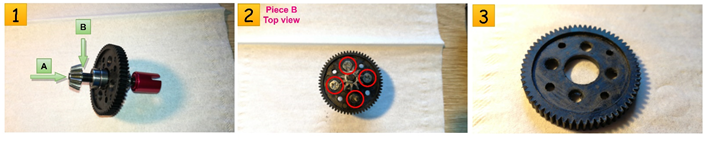

**Mount them back**

    * Grease all moving parts .
    * Tighten the screws equally (do not screw them too hard) in the specified order.
    * Try spinning the driving shaft and make sure that it does not have blocking points.

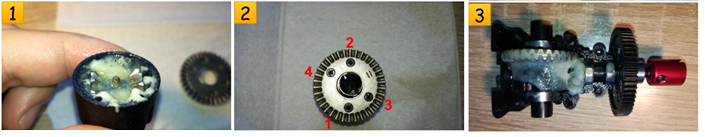

**The distance between cogwheels’ axis**

    * The cogwheels are not perfectly round, therefore at a complete spin of wheel A, the space between the two might vary. This can result in:
        - Losing grip;
        - Locking the wheels.
    * What you should do:
        - Loosen up the C screw;
        - Let someone spin both front wheels in order to see if the wheels are still coupled together while you are adjusting the distance between the two.
    * When do you know it’s done?
        - This step can be considered done when the wheels move smoothly for a total spin of A cogwheel, with the mention that the cogwheels should be permanently jointed (When tightening the C screw back the cogwheel may move, and so modify the distance between the axis and therefore it might need to be setup properly once again).

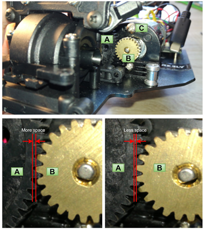

**Front axist differential**

The front axis differential also needs the same treatment as the rear one. So just adapt the upper lines to the front one.

The abnormal free movement of the wheels
----------------------------------------

It is true that the wheel may seem a little bit too loose but this is not a bad thing. You have to make a compromise:
    * A freer move results in loose parts.
    * Firm parts result in not such a free move.

Our suggestion is to put a very thin (how thin, it depends on the gap between bearing and safety cylinder) washer between the bearing and driving shaft joint. 
You should compare a wheel that doesn’t have a washer with the one you just mounted and see if it is ok for you.

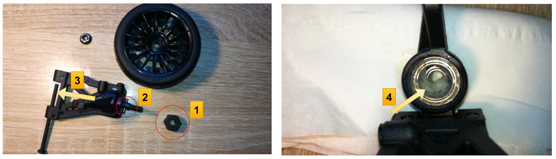

Always be sure that the driving shafts are moving freely
--------------------------------------------------------

The highlighted parts are the driving shafts. They should always freely move regardless of the wheels' position and car’s distance to the ground.

.. image::  ../../images/hardwaresetupforcar/hardware_improvements/drivingshaft.png
   :align: center
   :width: 50%

In order to let the driving shaft move freely, you need to increase the gap between the wheel and the differential:
    * Take the suited hex key and unscrew both the upper and lower screws a little bit.
    * Repeat the previous step until your driving shaft moves freely in any situation

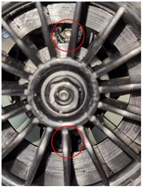

Steering
--------
The servo needs one more screw to ensure that the steering column never jumps out. The position is hard to reach when the car is fully assembled, 
so three options are available (beforehand, make sure that both Nucleo and servo are properly powered on when screwing, this way, the servo will be 
set to the 0 position).

- You can either fix it when working on the frontal differential (more exactley when it is removed).
- Placing the rod when the car is assembled, unscrewing the servo without removing the rod, fixing the rod with the screw and place the servo back.
- For those of you with more patience, an angle screwdriver can be improvised.

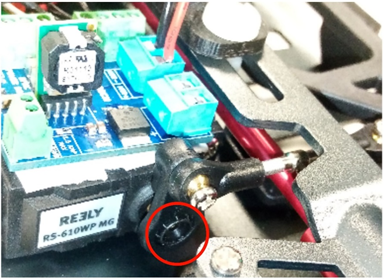

Setting the wheels’ Camber
--------------------------

**What is the wheel’s Camber?**

The Camber is the angle at which the wheel and tire stand relative to a perfectly flat surface and it can be positive or negative. A positive Camber means that 
the top of the wheel is pointed outwards, whereas negative Camber means the opposite, the top of the tire is leaned in closer to the car. Each of those two types 
of Camber have theirs advantages and disadvantages. For the purpose of the challenge, we suggest a negative Camber approach.

**What are the advantages of negative Camber?**

    * Improved handling of the vehicle;
    * Reduced wheel vibration when turning;
    * Possibility of cornering with higher speed;
    * Steering reacts more directly;
    * Steering forces are reduced;
    * Lower cornering angles

**How to set front axle Camber?**

There are two ball-head screws (red circled). In order to set the front axle Camber you have to twist them using a 2.5 mm hexagon wrench that is inserted through 
the wheel’s rim. Unscrew the upper screw more than the lower one. Try as much as you can to set the Camber similar both left and right sides. If you unmount the 
wheel, you will see a plastic grub screw as in (green circled) that can be tighten with a 5 mm hexagon wrench. That only serve for fastening the axis stub to the 
ball-head screws (red circled). We suggest you check that both ball-head screw can move freely before you reattach the wheel. Always check for the suspension also 
to move freely after setting the Camber.

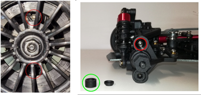

**How to set rear axel Camber?**

In order to set the Camber, you will need to turn the red circled screws so that the distance between the chassis and the top part of the wheels modify. The part 
doesn’t have to be disassembled in order to be modified, but of course you can remove and measure it with a caliper rule. Another way of modifying the rear axle 
Camber would be to change the mounting position of the traverse link into the rear axle leg (which has available three different mounting holes – the green circled parts).

.. image::  ../../images/hardwaresetupforcar/hardware_improvements/backaxle.png
   :align: center
   :width: 50%

Setting the wheels’ alignment?
-------------------------------

**What is wheel alignment?**

Wheel alignment describes the relation of the wheel level to the driving direction. It is usually known as “toe-in” or “toe-out” where the toe measurement is the 
distance between the front of the tires and the back of the tires. Toe-in should be used because it improves lateral cornering of the tyres and it also leads to 
a more direct response to steering.

**Setting front axle alignment**

The alignment on the front axle can be set by turning the track rod levers ( red circled). You do not have to dismantle them in order to do the adjustments, because 
they have threads in opposite. It is important that you set them equally (test after each modification that the car is moving straight).

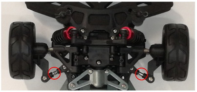

Adjust the car’s height
-----------------------

The car ground clearance is set at maximum through 4 screws. If you want to increase this ground clearance, you can unscrew them at the maximum level (please do not remove)
This is the location of the 4 screws:

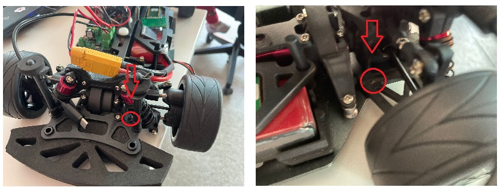

Adjust the car’s suspensions
-----------------------------

Eventhough the height of the ground clearance has increased, chances are that the car won't stay at that height, due to the fact that the suspensions can't push 
it that high. The good thing is that the suspensions can be hardened, and for each suspension you have 6 combinations. The suspensions can then be further hardened 
by adding a spacer between the spring and their support.

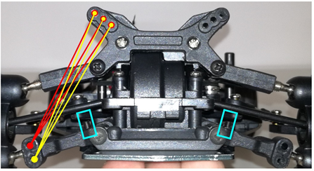
