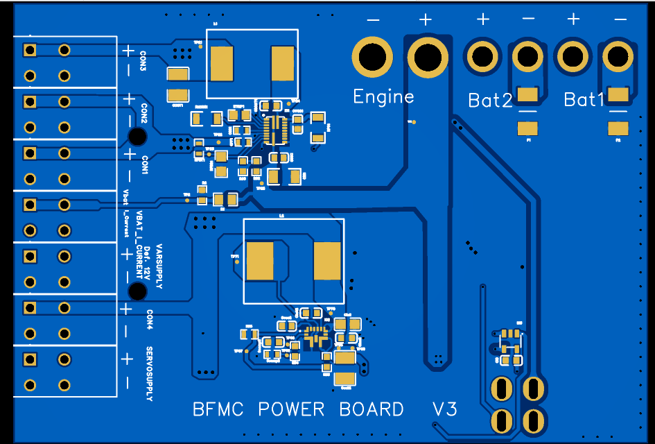

Power board
------------

On the robot we built a power distribution board which has the role of managing all the aspects of the power 
management inside the car.

For the protection of the batteries, the Powerboard has the following features:

    - To increase the cars autonomy, two batteries can be connected at any time (the board will work just fine with one).
    - The I_Current pin returns a voltage value proportional to the instant consumption of the board (0V - 0mAh, 3.3V - 29.89Ah).
    - The Vbat pin returns a voltage value proportional to the total voltage of the battery/s level (0V - 0V, 3.3V - 8.9V. Actualbatteryvoltage=Vbat/0.37).
    - For the current to flow through the board, the switch has to be enabled (Short). A  LED shows if the board is on.
    - If the current goes below 7V, the board will shut itself down. To safely replace the battery, switch off the board, change it with a fully charged one( >=7.35V), then switch it on.
    - The +12V(VARSUPPLY +) def pin has a default current value of 12v, which can be adapted to return a value from 4.5v to +18V max (max 3A) with the following formula: R33 = ((Vtarget - 0.6)xR35)/0.6; Where R35 must be below 300kΩ.
    - The + pin(CON1,CON2,CON3,CON4)is a 5V voltage level. The maximum current consumption of these pins is 15A.
    - The SERVOSUPPLY connector must be used to supply the servo motor. 
    - The motor pins can drain the battery until the voltage of the battery goes below 7.1V, then there will be no current flow so the LED should be off.
    - If the LED is off then the current consumption is almost zero(uA). 
    - If the LED is on and no aditional devices(DC motor, servo motor, development board etc) are functional the current consumptions is around 70mA.

All the data related to the powerboard can be found here:
`Power Distribution Board <https://github.com/ECC-BFMC/Documentation/tree/master/source/PCB/PWR_Board>`_
