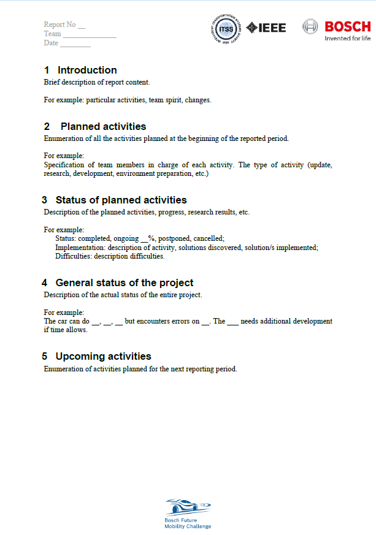

Periodic status and examples
=============================

**The information described below is only presented as an example. You have to create your own documents in order to organize and present your team work.
If used as it is, without adaptation to the team needs and plan, the team may lose points on the evaluation. We highly encourage you to adapt the models 
while under development to the actual status of the project.**

As mentioned in regulation, the project monitoring happens in 2 ways.

On the competition website and on github.

Website
-------

Each project report comes at a certain deadline. 

- Report (maximum 3 pages). It should raughly explain the sprint status.

- Media document (maximum 3 minutes and 50 MB long). It should show the current state of the vehicle (how many things it can do).

Github
------

On the Brain code, a structure containing "monitoring" and "project status" directories is present. 

In the monitoring section, you should be sure to adapt the plan and the architecture based on your SW/HW changes. 

If you feel that a hardware architecture would fit in the documentation of the project, feel free to add it. 

- Project plan example:

- Architecture example:

We recommend to first make software architecture. The architecture, is usually used in industry in order to have an overview of the project modules and the 
communication between them. This helps parallel development, features addition, debugging and portability of the modules to other projects. By having a strong 
architecture, you can make a project plan with deadlines, efforts, parallelisms and dependencies, so that all the team components can work in the same time 
without depending completely on other colleagues/modules and still respecting all the checkpoints of the project, represented in the time plan. 

Periodic reports are usually sent in industry so that the clients always know the status of the requested projects. We all know the saying "an image worth 1000 words", so 
in order to strengthen our view on your project, a multimedia file is required, emphasizing the actual work from the last month.

Following, you can see some examples of the requested documents.

The files presented here can be found also in editable formats here:
- `Periodics example`_

  .. _`Periodics example`: https://github.com/ECC-BFMC/Documentation/tree/master/source/periodic_report

