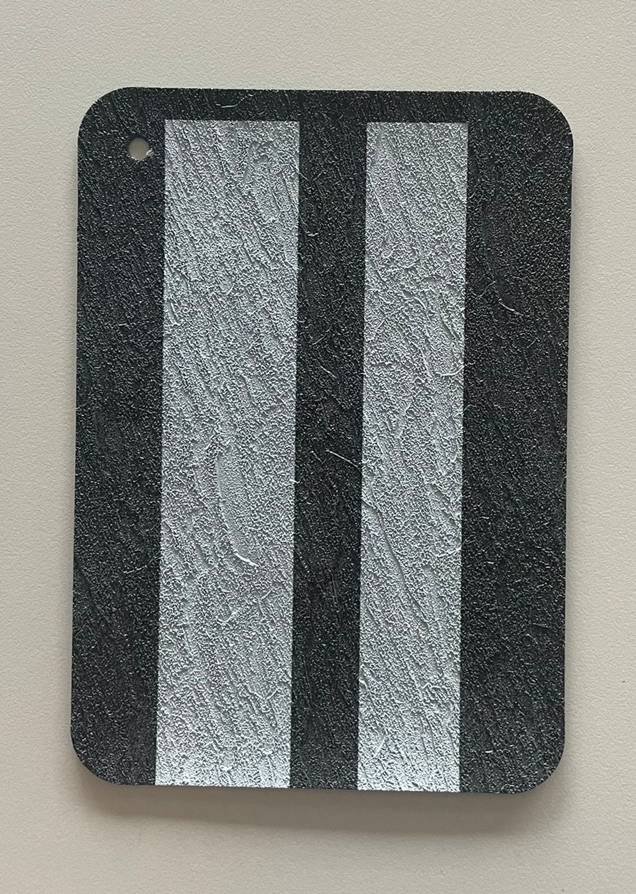
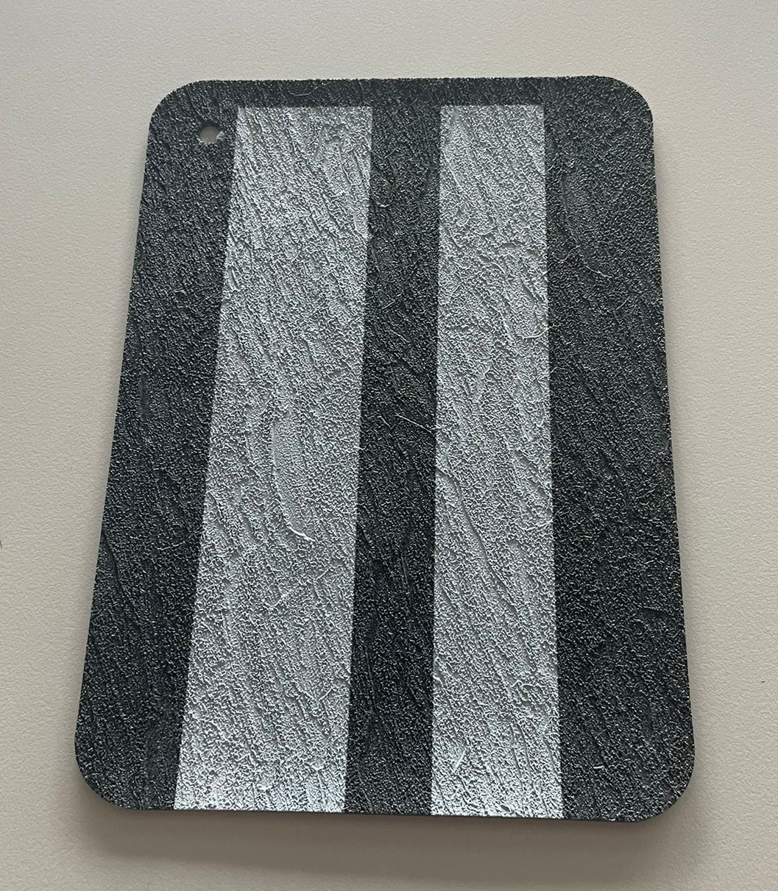
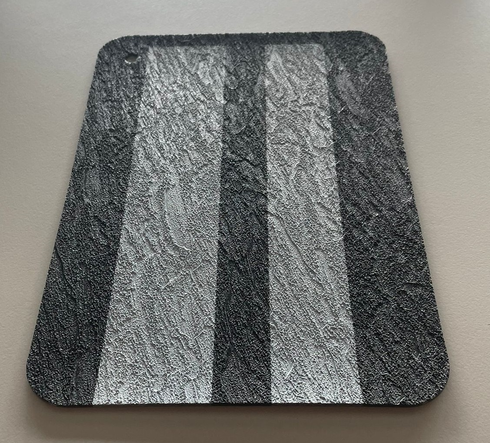
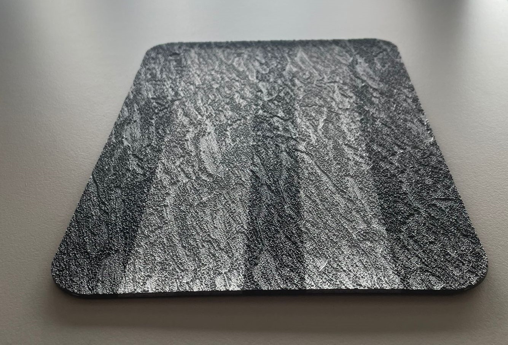

.. |vspace| raw:: html

   

Material
========

The material of the track itself is made of rolls 1.6 meters wide wide, printed on top with white paint:

The material can be found here: https://poolsidebycgt.com/europe/black-slate/

Down below you can see the reaciton of the track based on different light in angles. Notice that:
   - Images are raw, parameters are not adapted to the light.
   - The images were taken close to direct sunlight, which we will try to reduce at the location. 

|vspace|

|vspace|

|vspace|

