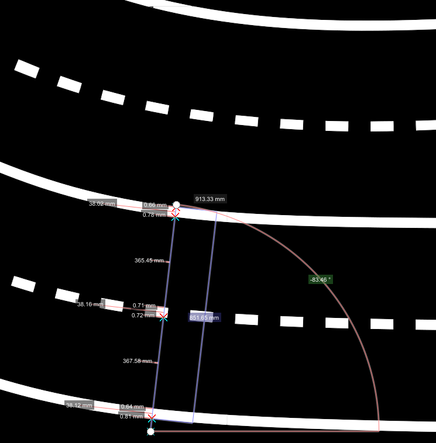
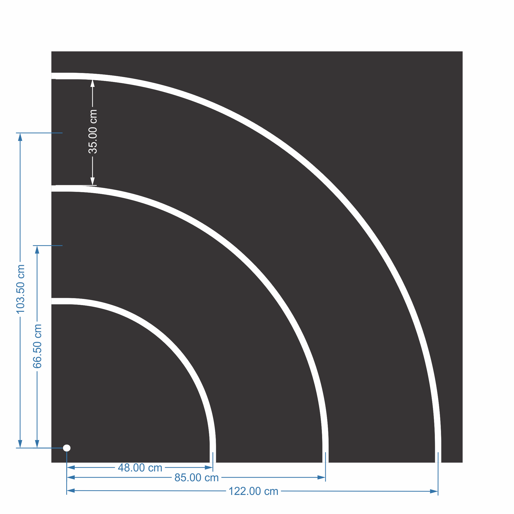
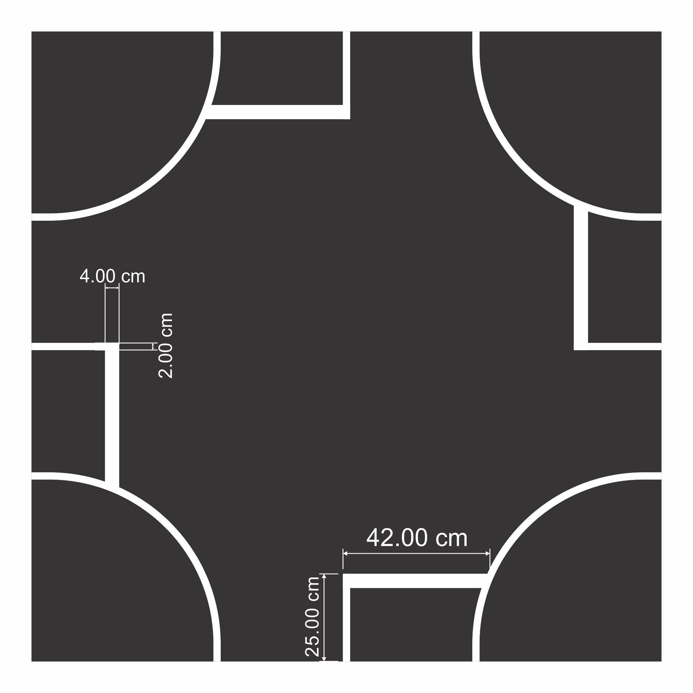
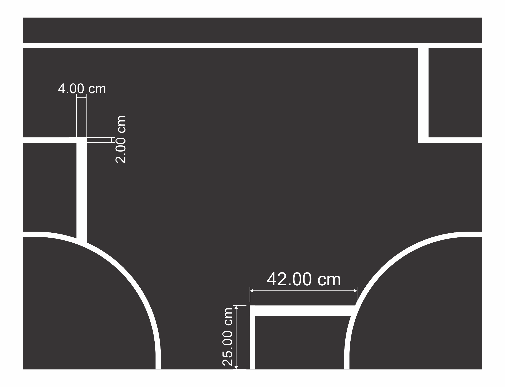
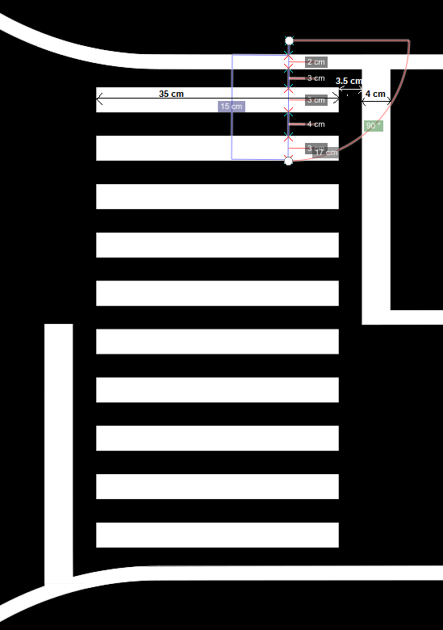
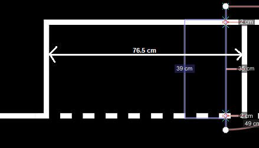
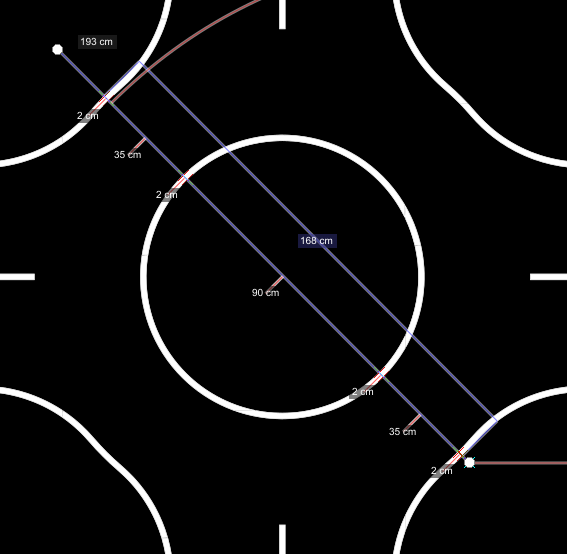
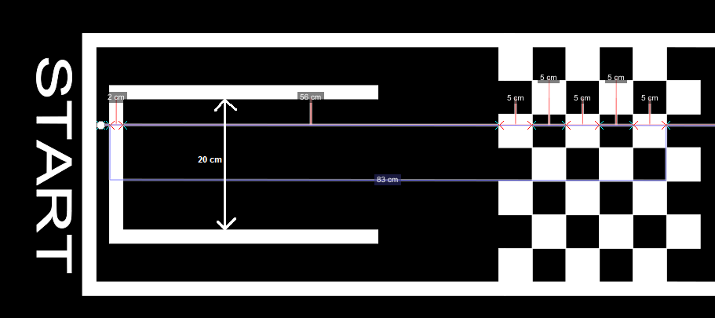

Road markings
==============

The lane markings may be dashed or continuous and are ~2cm wide white line, and the length between dashed lines is 4.5 cm,
the same being valid for the line itself. The lane has a width of ~35 cm, measured from the inside of the respective 
markings.

.. image:: ../../images/racetrack/road.png
   :align: center
   :width: 50%

As for the highway, the width of the lane is approximately 37 cm, where the lines are 4 cm in width
and the dashed line is of 9 cm on, 9 cm off.

The following image shows the tightest curve, which is the most common curve on the track. 

Below you can see the main types of intersections (more types are on the track, but the dimensions are similar).

Here are the dimensions for the crosswalk signalization (dimensions valid also for crosswalk on 1 lane).

Here are the dimensions for parking spots.

And the dimensions for the roundabout

**Starting point**

The starting point is made out of an incomplete rectangle, which is exactly the width of the vehicle (20cm)
and ends 56 cm from the chessboard print. 

The chessboard print is made out of a 7x6 squares matrix, occupying the entire width of the lane (5cm square).

The chessboard can be used for the automatic calibration of the camera at the start.

