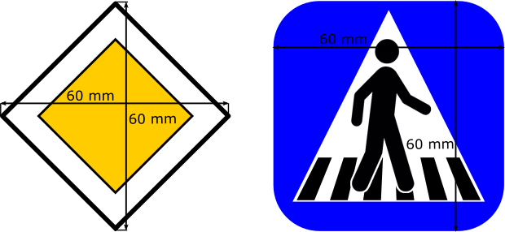
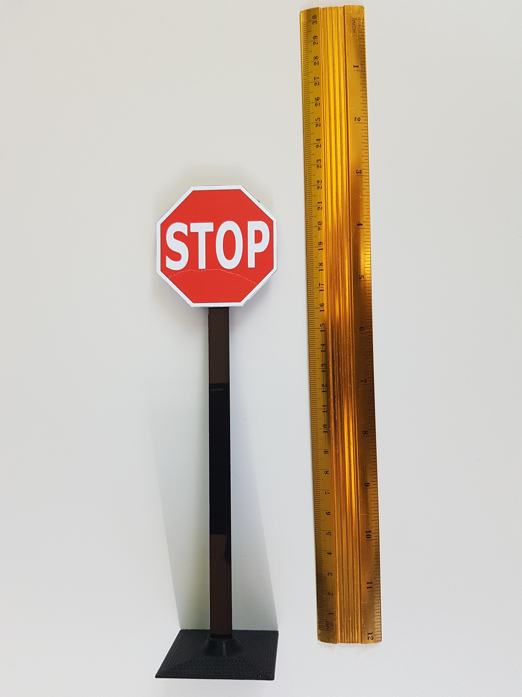
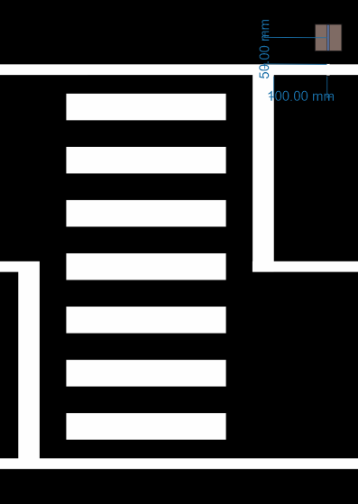

Traffic signs
=============

Signs
''''''

On the track can appear the following types of traffic signs:
 - Stop sign
 - Parking sign
 - Priority sign
 - Crosswalk sign
 - Highway entrance sign
 - Highway exit sign
 - Round-about sign
 - One way road sign
 - No-entry road sign
 
Here ou can find the `traffic signs <https://github.com/ECC-BFMC/Documentation/blob/master/source/racetrack/TrafficSign.pdf>`_  
in pdf format, which you can print in order to reproduce them.

Each sign is encapsulate in a 6x6 cm square (scaled accordingly). You can see two examples in the picture below:

Each sign is stuck on top of a pillar and that makes the traffic sign located at ~20 cm in height. Example below.

.. image:: ../../images/racetrack/TrafficSign_Construct.png
   :align: center
   :width: 50%

In the reality they look like on the pictures below:

Traffic sign pillar (3D)
------------------------
And here's the 3d models of the stands:
    - `Traffic sign base <https://github.com/ECC-BFMC/Documentation/blob/master/source/3DModels/TrackParts/SignPole_Base.STL>`_
    - `Traffic sign pole <https://github.com/ECC-BFMC/Documentation/blob/master/source/3DModels/TrackParts/SignPole.STL>`_

Location on the track
---------------------

The locations of traffic sign and light are similar and are calculated with respect to the 
object limitation (which can be an intersection, the end/beginning of the parking, or others). Each object 
is located ~10 cm before (or after, in depending on the case) the road signalization and ~5 cm 
outside the road limits.

