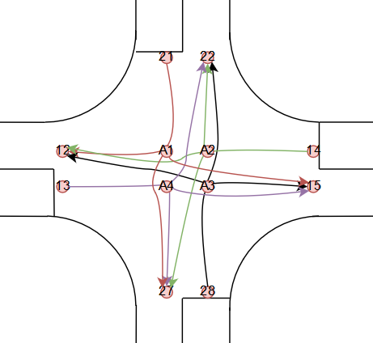

Traffic Communication
=====================

The API manages communication with the localization system and streams specific data to the live-traffic monitoring system (similar to Waze).

The API consists of five main components:
  - UDP Listener
    - Listens on port 9000 for messages from the server
    - Upon receiving a message, it validates it using the server's public key. Once validated, it activates the serverfound callback function, which establishes a TCP connection to the LiveTraffic server.
  - tcp Client
    - Maintains a continuous connection to the server or attempts to reconnect if the connection is lost.
    - Once connected, it signals the location device by passing its id(number on the device) to the server, and the frequency it wisesh to receive positions (must be between 0.1 and 5 seconds). 
    - Keeps getting the location of the device, then forwards it on the gateway as a message.
  - Periodic Task
    - Runs every second if the server is connected
    - Sends the data present in the shared, with the help of the tcp Client
  - Shared memory
    - Acts as a shared resource between the car and the periodic task
    - Provides methods for inserting data (done by the car) and retrieving data to send to the server (handled by the Periodic Task).
    

The position data will be sent to the tcp client (car) as x and y, z and quality of trustness in the position.

positions are sent in meters, quality is sent in percentage. The data is sent in the following format:

``{"x":float, "y":float, "z":float, "quality":int``

The data which must be sent to the livetraffic server is the following:

The shared memory
-----------------

**Speed of the vehicle, with 1HZ.**

``m = "deviceSpeed"``

``val = [8.1] # 8.1 is a speed example, Where speed is measured in cm/s``

``shared_memory.insert(m, val)``

**Position of the vehicle, with respect to the track coordinate system, with 1HZ.**

``m = "devicePos"``

``val = [12.3, 6.9] # 12.3 is a x example, 6.9 is a y example, Where position is measured in meters``

``shared_memory.insert(m, val)``

**Rotation of the vehicle, with 1HZ.**

``m = "deviceRotation"``

``val = [191] # 191 is a rotation example, Where rotation is measured in degrees. 0 deg is considered the starting point and orientation. MEasurement is done clockwise``

``shared_memory.insert(m, val)``

**Obstacle encountered, once x obstacle.**

``m = "historyData"``

``val = [2, 7.2, 3.8] # 2 is the id of the obstacle, 7.2 is the x of the obstacle, 3.8 iw the y of the obstacle. Where the id's can be found in the following table.``

``shared_memory.insert(m, val)``

+-----+---------------------------------+
| ID  | Description                     |
+=====+=================================+
| 1   | Traffic Sign - Stop             |
+-----+---------------------------------+
| 2   | Traffic Sign - Priority         |
+-----+---------------------------------+
| 3   | Traffic Sign - Parking          |
+-----+---------------------------------+
| 4   | Traffic Sign - Crosswalk        |
+-----+---------------------------------+
| 5   | Traffic Sign - Highway entrance |
+-----+---------------------------------+
| 6   | Traffic Sign - Highway exit     |
+-----+---------------------------------+
| 7   | Traffic Sign - Roundabout       |
+-----+---------------------------------+
| 8   | Traffic Sign - One way road     |
+-----+---------------------------------+
| 9   | Traffic Sign - No Entry         |
+-----+---------------------------------+
| 10  | Static car on parking           |
+-----+---------------------------------+
| 11  | Pedestrian on crosswalk         |
+-----+---------------------------------+
| 12  | Pedestrian on road              |
+-----+---------------------------------+
| 13  | Roadblock                       |
+-----+---------------------------------+
| 14  | Traffic light                   |
+-----+---------------------------------+
| 15  | Fog                             |
+-----+---------------------------------+
| 16  | Tunnel                          |
+-----+---------------------------------+
| 16  | Ramp                            |
+-----+---------------------------------+

Localization system 
-------------------

It has four main components: server, localization box and anchor device and tag device. 
The anchors are set into know positions on the track. The tag devices, communicate with the anchors in order to get their position on the map; 

The localization box instead does the following:
  - Reads via I2C communication the tag location on the map. 
  - Calculates it's accurate position on the map, integrating BNO055.
  - Hosts a BLE server and waits for the server connection to it.
  - Shares RAW and calculated position on the map.

The server collects and stores the data from the tag devices and waits for connections from the 
robot clients; then, upon connection, it serves the desired data to the clients (raw data only). Down below a picture describing the process.

The system will be installed at the phisical competition. It is made of two components: one fixed component that will be glued to the car body upon arrival 
and the actual device, which the team will get only while on the track. The active part will have displayed the ID of the connection. In the following image you 
can see the place where the device will be placed, the fixed component and the actual device.

.. image::  ../../images/vehicletoeverything/Localisation_system_HW.png
  :align: center
  :width: 50%

The device weights 280 grams and the mandatory position for the device is the one in the picture. The design can be found here:
  - `Bottom`_
  - `Box`_
  - `Top`_
  
  .. _`Bottom`: https://github.com/ECC-BFMC/Documentation/blob/master/source/3DModels/Locsys/Locsys_Bottom.STL
  .. _`Box`: https://github.com/ECC-BFMC/Documentation/blob/master/source/3DModels/Locsys/Locsys_Box.STL
  .. _`Top`: https://github.com/ECC-BFMC/Documentation/blob/master/source/3DModels/Locsys/Locsys_Tap.STL

Technical data of the system:
 - The frequency of the read locations is 10 Hz
 - The error of the system is of maximum 15 cm radius
 - The delay of the received messages is ~1 second

Mapping of the track
--------------------
A digital map is provided in order to help the teams navigate in the environment. The map is saved in XML format and it is exported with the help of the GraphML 
library (making it easier to be imported on your platform). There are two types of information: Nodes and Connections. Each node is placed in the middle o a lane 
and the distance between 2 nodes(on the same lane) will be roughly ~30 cm, with some variations. A connection describes the relations between twp nodes (dotted 
or continuous line). Here you can see a straight road visual example:

.. image::  ../../images/vehicletoeverything/StraighRoadExample.PNG
  :align: center
  :width: 50%

Every node has 3 attributes: Id, X coordinate, Y coordinate. On the connectivity table instead, we have the start node id, the end node id and the type of 
connection (straight or dotted road: TRUE or FALSE). 

+------+-------+-------+--------+--------+----------+
| Nodes table          | Connections table          |
+======+=======+=======+========+========+==========+
|  id  |   X   |   Y   |  Id_1  |  Id_2  |  Dotted  |
+------+-------+-------+--------+--------+----------+
|   1  |  3.6  |  2.4  |   1    |   2    |   TRUE   |
+------+-------+-------+--------+--------+----------+
|   2  |  4.0  |  2.4  |   2    |   3    |   FALSE  |
+------+-------+-------+--------+--------+----------+
|   3  |  4.4  |  2.4  |   3    |   4    |   FALSE  |
+------+-------+-------+--------+--------+----------+
|   4  |  4.8  |  2.4  |                            |
+------+-------+-------+--------+--------+----------+

In the intersections case, there will be 3 points with the same coordinates for a 3 roads intersection(A1, A2, A3) and 4 points for a 4 roads intersection(A1, 
A2, A3, A4). This symbolization is done so to simulate a layered highway intersection, and so, helping you plan the path without taking into consideration U 
turn cases inside the intersection (if we only have a single point connected to all the nodes, then a turn like 18-A-17 would be possible). The representation 
is done in the following images.

|pic1|  |pic2|

.. |pic1| image:: ../../images/vehicletoeverything/3roadsExample.PNG
   :width: 35%

You can find the figure and the digital representation of the competition track at the following links: 
 - `Competition track figure`_
 - `Competition track digital`_

  .. _`Competition track figure`: https://github.com/ECC-BFMC/Documentation/blob/master/source/racetrack/Competition_track_graph.png
  .. _`Competition track digital`: https://github.com/ECC-BFMC/Documentation/blob/master/source/racetrack/Competition_track_graph.graphml

To run
------
Run the src/data/TrafficCommunication/processTrafficCommunication.py

- For tesing purposes, publickey_server_test.pem should be used (self.filename = "src/data/TrafficCommunication/useful/publickey_server_test.pem" should be the value of line 39), as it connects to the simulated server.
- For the competition, publickey_server.pem should be used (self.filename = "src/data/TrafficCommunication/useful/publickey_server.pem" should be the value of line 39)  
